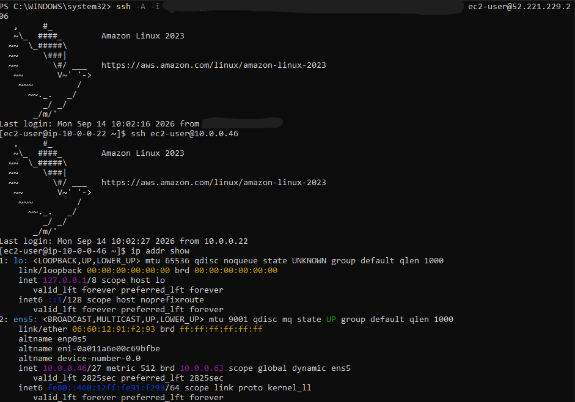

# Secure Multi-AZ AWS Infrastructure with Terraform

A secure, highly-available AWS network built entirely with Terraform — featuring a bastion host access pattern, private subnet isolation, and full audit logging. Built to develop hands-on Infrastructure as Code experience after identifying a gap between theoretical knowledge and practical implementation during a technical interview.

## Architecture

The infrastructure spans two Availability Zones for redundancy, with a clear separation between public-facing and internal resources:

- **VPC** (`10.0.0.0/24`) containing 4 subnets across `ap-southeast-1a` and `ap-southeast-1b`
- **Public subnets** — host the bastion host and NAT Gateways, with a route to an Internet Gateway
- **Private subnets** — host the application server, with no direct route to the internet
- **2 NAT Gateways** (one per AZ) — allow private subnet resources to reach the internet outbound only, without being reachable from it
- **Bastion host** — the only entry point into the network; all administrative SSH access is routed through it
- **CloudTrail** — multi-region audit logging of all API activity across the account

## What This Demonstrates

- Infrastructure as Code using Terraform (HCL)
- VPC design with public/private subnet segmentation
- Multi-AZ high availability architecture
- NAT Gateway configuration for controlled outbound-only access
- Security group design using least privilege, including security-group-to-security-group referencing rather than static IP rules
- Bastion host pattern for secure administrative access
- CloudTrail configuration with a scoped S3 bucket policy
- Separation of sensitive/environment-specific values from code using Terraform variables
- End-to-end verification via SSH, not just static configuration review

## Architecture Decisions

**Why a `/24` VPC instead of the commonly-used `/16` default**
A `/16` VPC provides 65,536 addresses — far more than this project needs. The CIDR block was deliberately right-sized to `/24` (256 addresses) to match the actual scope of the deployment, split into four `/27` subnets (32 addresses each) across two Availability Zones.

**Why 2 NAT Gateways instead of 1**
A single NAT Gateway creates a single point of failure — if its Availability Zone experiences an outage, every private subnet loses outbound internet access, regardless of which AZ they're in. Running one NAT Gateway per AZ ensures each private subnet routes through a NAT Gateway in its own zone, preserving availability even if one AZ fails. This adds cost (each NAT Gateway is billed hourly) but was a deliberate trade-off for genuine high availability rather than a cost-optimized single-gateway design.

**Why a bastion host instead of direct SSH access to the private instance**
The application server sits in a private subnet with no public IP and no route to the internet inbound. To perform administrative access (e.g. troubleshooting, Day 2 operations tasks), a bastion host in the public subnet acts as the single controlled entry point. SSH access is only permitted to the bastion from a specific IP; the private instance only accepts SSH from the bastion's security group — not from any IP directly, including the administrator's own. This ensures a single, auditable point of entry into the private network.

**Why the private instance's security group references the bastion's security group, not an IP**
Referencing a security group ID (`security_groups = [aws_security_group.bastion_sg.id]`) rather than a CIDR block means the private instance trusts traffic based on *identity* (anything with the bastion's security group attached) rather than *location* (a specific IP address). This is more robust — it doesn't break if the bastion's IP changes, and it can't be spoofed by traffic merely originating from the right-looking IP.

**Why sensitive values are separated into variables**
The administrator's IP address and local SSH key file path are both environment-specific and not meant to be public. These are declared as Terraform variables (`variables.tf`) and supplied via a local `terraform.tfvars` file, which is excluded from version control via `.gitignore`. This keeps the core infrastructure code fully reusable and safe to share publicly.

## Prerequisites

- [Terraform](https://developer.hashicorp.com/terraform/install) >= 1.0
- AWS CLI configured with valid credentials (`aws configure`)
- An AWS account with permissions to create VPC, EC2, NAT Gateway, S3, and CloudTrail resources
- An SSH key pair generated locally (`ssh-keygen`)

## Deployment

1. Clone this repository
2. Create a `terraform.tfvars` file in the project root with the following:
```hcl
   my_ip                = "YOUR_IP_ADDRESS/32"
   ssh_public_key_path  = "path/to/your/key.pub"
```
3. Initialize Terraform:

terraform init

4. Review the deployment plan:

terraform plan

5. Deploy:

terraform apply


**Note:** This deployment includes 2 NAT Gateways, which incur hourly charges even under the AWS Free Tier. Destroy the infrastructure after use to avoid ongoing cost:

terraform destroy


## Verification

The architecture was validated end-to-end, not just reviewed statically:

1. SSH'd into the bastion host from a local machine, using SSH agent forwarding
2. From the bastion, SSH'd into the private application server using its private IP
3. Confirmed the private instance has no public IPv4 address (`ip addr show`)
4. Confirmed the private instance can still reach the internet outbound via NAT Gateway (`curl https://checkip.amazonaws.com` returned the NAT Gateway's public IP, not the instance's own)



## Cost Considerations

Most resources in this project (VPC, subnets, security groups, EC2 `t3.micro`, CloudTrail) fall within the AWS Free Tier. **NAT Gateways are the exception** — they are billed hourly regardless of Free Tier eligibility (~$0.045/hour each, plus data processing charges). This project was deployed, verified, and destroyed within the same session to minimize cost.

## Future Improvements

- CI/CD pipeline (GitHub Actions) to automate `terraform plan` on every commit
- IaC security scanning (Checkov/tfsec) integrated into the pipeline
- CloudWatch alarms and monitoring for the deployed instances
- Migrating remote state to an S3 backend with state locking (currently local state only)

## Tech Stack

Terraform · AWS (VPC, EC2, NAT Gateway, S3, CloudTrail, IAM) · Amazon Linux 2023